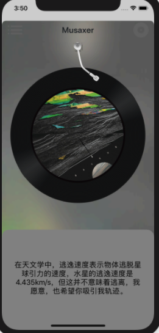

<div align=center></div>

[TOC]

## Musaxer - 一个流媒体音乐播放器

学校iOS开发App大作业，基于 FreeStreamer 的一个简单流媒体播放器，供作学习用途

## 程序运行界面截图

| | |
|  :----------------------------------------------------------:  |  :----------------------------------------------------------:  |
| Luanch Screen | Loading |
|             |                  |
| 列表界面 | 播放界面 |
|  |  |
| 暂停 | 收藏 |
|  |  |
| 更多菜单 | 删除图片缓存 |
|  |  |
|  歌曲评价 | 歌词 |
|  |  |


------

## 开发环境 

> Macos 10.14, Xcode 11.1
> 若运行时遇到大量头文件未找到的报错，则在终端运行以下命令即可解决：
> 
> ``` shell
> cd Musaxer
> pod install
> ```
>
> 测试机型 iPHone 11 pro
> 部署目标平台 IOS 9.0 +

------

## 获取列表 URL

> [https://raw.githubusercontent.com/SplitGemini/Music/master/Tracks.json](https://raw.githubusercontent.com/SplitGemini/Music/master/Tracks.json)

#### 接口示例

``` json
{
  "data": [
      {
      "musicId": 1,
      "musicName": "...",
      "artistName": "...",
      "cover": "...",
      "musicUrl" : "...",
      "fileName" : "...",
      "musicDescription" : "...",
      "musicLyric" : "..."
      },
      ...
  ]
}

```

## Pods

- [AFNeetworking](https://github.com/AFNetworking/AFNetworking)
- [FreeStreamer](https://github.com/muhku/FreeStreamer)
- [FTPopOverMenu](https://github.com/liufengting/FTPopOverMenu)
- [GVUserDefaults](https://github.com/gangverk/GVUserDefaults)
- [MBProgressHUD](https://github.com/jdg/MBProgressHUD)
- [MJExtension](https://github.com/CoderMJLee/MJExtension)
- [NAKPlaybackIndicatorView](https://github.com/yujinakayama/NAKPlaybackIndicatorView)
- [Reachability](https://github.com/tonymillion/Reachability)
- [SDWebImage](https://github.com/SDWebImage/SDWebImage)